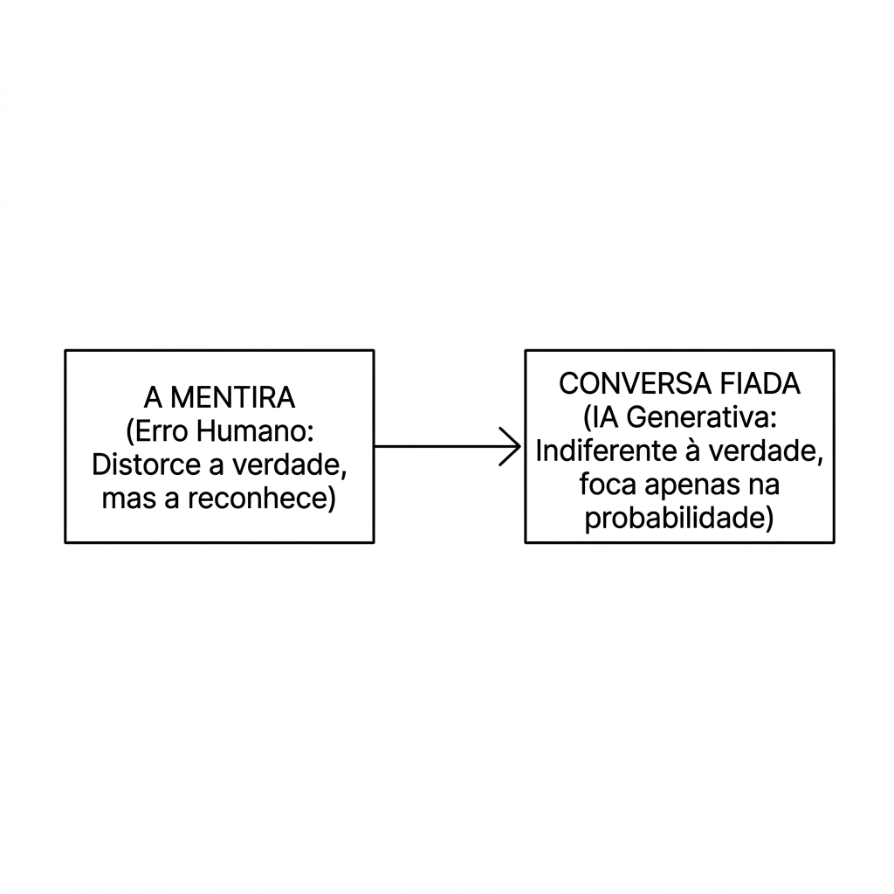
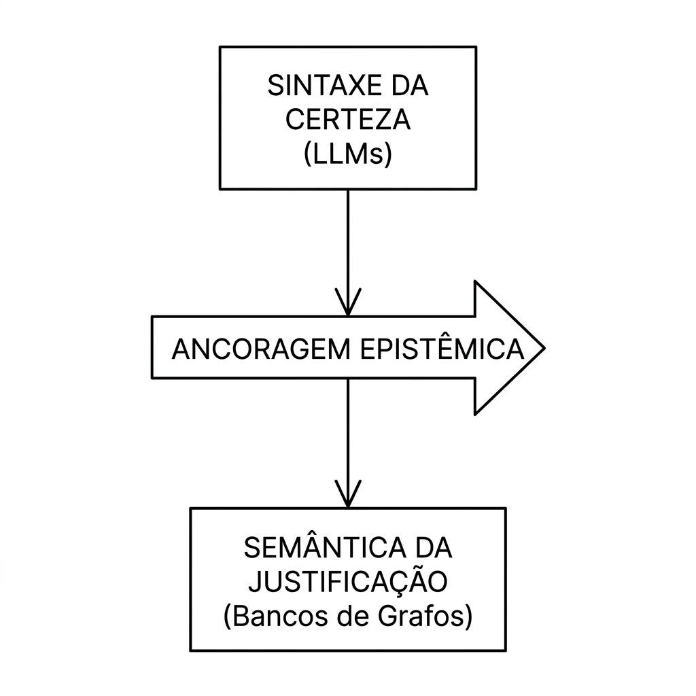

# Why AI Creates a False Sense of Certainty

If you have ever conversed with a modern language model, you have likely experienced a curious sensation. You ask a complex question—perhaps about an obscure historical topic, a legal issue, or a technical programming question—and receive an answer in seconds. The machine does not hesitate. It does not show uncertainty. It does not seem to revise what it just said.

I am not referring here to the style or tone of the response, but to its form. As a rule, what we receive is an impeccably structured, grammatically correct text presented with impressive security.

This formal perfection produces a nearly automatic psychological effect in us: the feeling that we are facing solid knowledge.

As a data engineer who daily bridges Earth sciences, technology, and philosophy, this phenomenon fascinates and, at the same time, concerns me. Contemporary artificial intelligence is a machine for simulating conviction. To understand why this happens—and why it represents a growing risk for organizations and society—we need to cross the border between epistemology and the mathematics of language models.

## 1. The paradox of syntactic authority

We, humans, associate verbal clarity and fluency with intellectual competence. When someone speaks articulately, without apparent hesitation and with well-structured arguments, we tend to attribute credibility to what is being said.

This is a deeply rooted social heuristic.

Language models exploit this heuristic in an extraordinary way.

They are extremely effective at producing coherent and convincing linguistic structures. However, they do not have direct access to the world or their own validation mechanisms for what they assert. Their relationship with reality is mediated by the linguistic patterns present in the training data.

When a model answers a question, it does not consult facts in the same way a researcher consults sources, nor does it compare its statements with an internal representation of reality. It produces a linguistically plausible continuation based on statistical patterns learned from huge volumes of text.

From this arises what we might call the paradox of syntactic authority: the machine speaks with the authority of who knows, but without necessarily participating in the processes that traditionally justify knowledge.

The appearance of certainty does not stem from an investigation. It stems from the fluidity of language.

## 2. The difference between lies and bullshit

In his classic essay *On Bullshit*, philosopher Harry Frankfurt proposes an important distinction between the liar and the bullshit producer.

The liar knows the truth and tries to hide it. His action remains oriented by reality, albeit negatively. To lie, one must recognize what one intends to distort.

The bullshit producer, on the other hand, is committed neither to truth nor to falsehood. His interest is not to correctly represent the world, but to produce a certain effect on the listener. The relationship with reality becomes secondary.

If we apply this distinction analogously to language models, they are much closer to bullshit than to lies.

When a model invents a non-existent bibliographical reference, attributes a quote to an author who never wrote it, or creates an imaginary legal precedent, it is not trying to deceive anyone deliberately. There is no intention involved.

The problem is different: the truth of the statement is simply not part of the process that generated the response.

The system is optimizing linguistic coherence, not correspondence with reality.

Therefore, a true statement and a false statement can appear equally convincing. Both can possess exactly the same syntactic elegance.

## 3. The mathematics of empty conviction

The origin of this artificial conviction lies in the very architecture of the models.

During text generation, the model produces a probability distribution for the next possible tokens and selects a continuation from this distribution.

What it learns is a statistical structure of language.

But statistical probability is not epistemic justification.

This distinction is fundamental.

Epistemology does not only ask how a belief was produced; it asks how that belief can be justified. A language model produces highly probable answers within a statistical system. This does not mean they are justified in relation to the world.

A statement can appear thousands of times in the training data and still be false. Likewise, correct information can be underrepresented or absent.

Because the model lacks its own external verification mechanisms, frequency and truth become dangerously close concepts.

In simple terms: the system can present huge statistical confidence in something that has no factual support.

And it will do so with the same ease with which it would present correct information.

## 4. The problem is not the error, but the persuasive error

Every technology produces errors.

The problem with language models is not the existence of error, but its presentation.

An incorrect report produced by a human analyst usually carries signs of uncertainty. There are gaps, hesitations, reservations, or ambiguities that often function as warnings for the reader.

In contrast, an error produced by a language model tends to come packaged in an impeccable textual structure.

The result is a particularly sophisticated form of automation bias: we start to trust the response because it seems better articulated than our own justifications.

In corporate environments, this can generate relevant consequences.

An incorrect financial analysis, an erroneous legal interpretation, or a poorly substantiated strategic recommendation can bypass several validation stages simply because the text looks competent.

Formal persuasion masks epistemic fragility.

## 5. AI does not just answer: it transforms conversation

There is, however, an even deeper problem.

We tend to think that artificial intelligence only affects the quality of answers. But it also alters the conditions of conversation itself.

Historically, human knowledge has been constructed through collective processes marked by doubt, revision, dispute, and argumentation. A provisional answer was followed by objections; a hypothesis was subjected to tests; an assertion had to survive the scrutiny of others.

Language models introduce a new element into this process: instant, articulate, and apparently complete answers.

When an answer arises without hesitation, it reduces our willingness to continue investigating. The very dynamic of conversation changes. Doubt ceases to be a starting point and begins to look like a defect.

The risk, therefore, is not just receiving wrong answers. It is becoming less inclined to question them.

Technology does not just change the content of knowledge. It changes the cognitive habits through which we produce knowledge.

## 6. The epistemic exit: systems anchored in justification

If the problem is not simply technological, its solution will not be either.

It is not enough to wait for larger, faster models trained with more data.

The challenge is to build external mechanisms of justification.

In corporate environments, this means developing architectures in which language models are coupled with verifiable structures of knowledge.

Some examples include:

* **Knowledge graphs and ontologies**, which explicit logical relations and constraints on relevant business facts;

* **Information retrieval systems with traceability**, which link assertions to specific documents, databases, or sources;

* **Automated validation pipelines**, capable of verifying whether certain conclusions are compatible with available data;

* **Human audit processes**, especially in high-impact contexts.

The goal is not to eliminate the generative capacity of models, but to subject it to independent validation mechanisms.

In other words: we need to complement the fluency of language with structures of justification.

## Conclusion

The real risk of artificial intelligence is not producing errors. Errors are inevitable in any cognitive system.

The risk lies in producing errors without the signals normally associated with error: hesitation, ambiguity, revision, or doubt.

For the first time, we live with a technology capable of simulating knowledge without participating in the practices that traditionally justify knowledge.

The central question, therefore, is not whether language models know anything.

The question is whether we will continue to know how to distinguish between a convincing answer and a justified answer.

Never trust only the certainty of a machine that does not know what doubt is.
